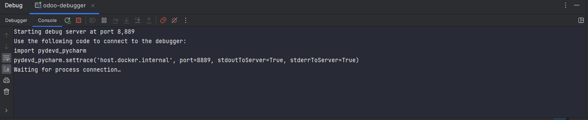

# odoo-docker-pycharm-env

- ## Description

This is my Odoo environment for development using Docker and Pycharm Professional, feel free to use
it.

## Requirements
- Docker
- Docker Compose
- Pycharm Professional
- Optional: Odoo Plugin for Pycharm

## Usage

### Clone this repository
Remove the .git folder to avoid conflicts with your own git repository
``` bash
git clone https://github.com/helpad/odoo-docker-pycharm-env
rm -rf ./odoo-docker-pycharm-env/.git
```

### Build the docker image
``` bash
cd odoo-docker/dockerfiles
docker build -t odoo:dev .
cd ../..
```

### Add the db and odoo folders
``` bash
mkdir odoo-data/odoo-db
mkdir odoo-data/odoo-data
```

### Configure the pycharm project
- add remote interpreter

- add remote debug configuration


### Start the debug server



### Start the containers
``` bash
cd odoo-docker/odoo-dev-env
docker-compose up -d
```

### Configure postgresql datasource


with a demo database


introspecting the database


